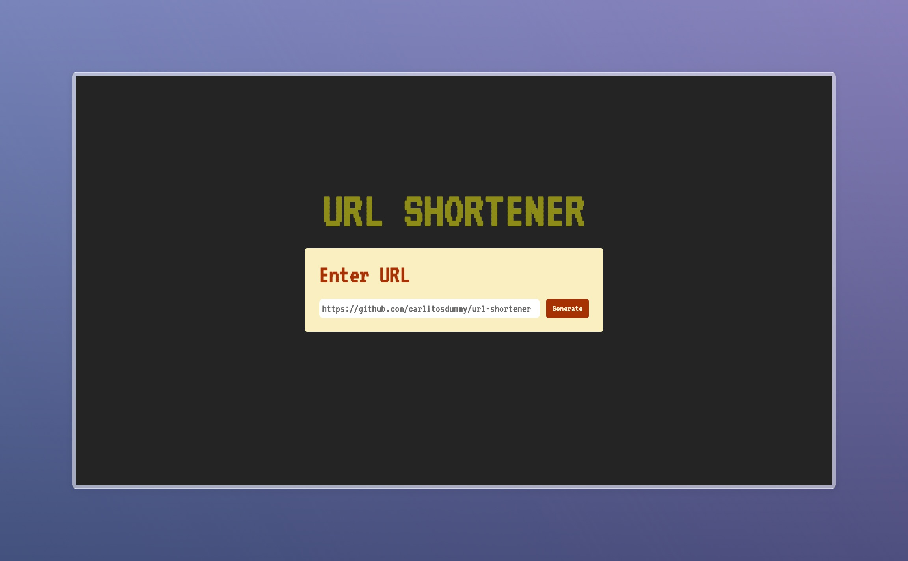

# URL Shortener

This is a simple and efficient URL shortener built with React and Vite. It's designed to quickly generate shortened URLs and provide a user-friendly interface for managing them.

## Quick Usage

If you want to use the application quickly without installing it locally, you can visit the live version of the application <a href="https://dummy-url-shortener.netlify.app/" target="_blank">here</a>.

## Features

- **Efficient URL Shortening**: Quickly shorten any URL.
- **Easy Copy to Clipboard**: With a single click, you can copy the shortened URL to your clipboard.
- **Reset Functionality**: Easily generate new shortened URLs.

## Technologies Used

This project uses the following technologies:

- **API**: We are using the [RapidAPI's URL Shortener service](https://rapidapi.com/BigLobster/api/url-shortener-service). This API provides us with the ability to generate shortened URLs. It is used in the [`useGetShortUrl`](src/hooks/useGetShortUrl.jsx) hook, where a POST request is made to the API with the original URL as a parameter. The API then returns a shortened version of the URL.

- **Other Technologies**: 
    - **React**: A JavaScript library for building user interfaces. It is used throughout the project to create reusable UI components.
    - **Vite**: A build tool that provides a faster and leaner development experience for modern web projects. It is used for building the project in development and production environments.
    - **pnpm**: A fast, disk space efficient package manager. It is used for managing the project's dependencies.
    - **ESLint**: A tool for identifying and reporting on patterns found in ECMAScript/JavaScript code. It is used in the project to maintain code quality.

## Installation

Follow these steps to install the project:

1. Clone the repository: `git clone https://github.com/yourusername/url-shortener.git`
2. Navigate into the project directory: `cd url-shortener`
3. Install the dependencies: `pnpm install`

## Usage

To run the project, use the command: `pnpm run dev`

This will start the development server. You can then navigate to `localhost:5173` in your web browser to view the application.

## Contributing

Contributions are welcome! If you have an idea for a feature or improvement, feel free to open a pull request. For major changes, please open an issue first to discuss your proposed changes.

## License

This project is licensed under the [MIT License](https://choosealicense.com/licenses/mit/).
